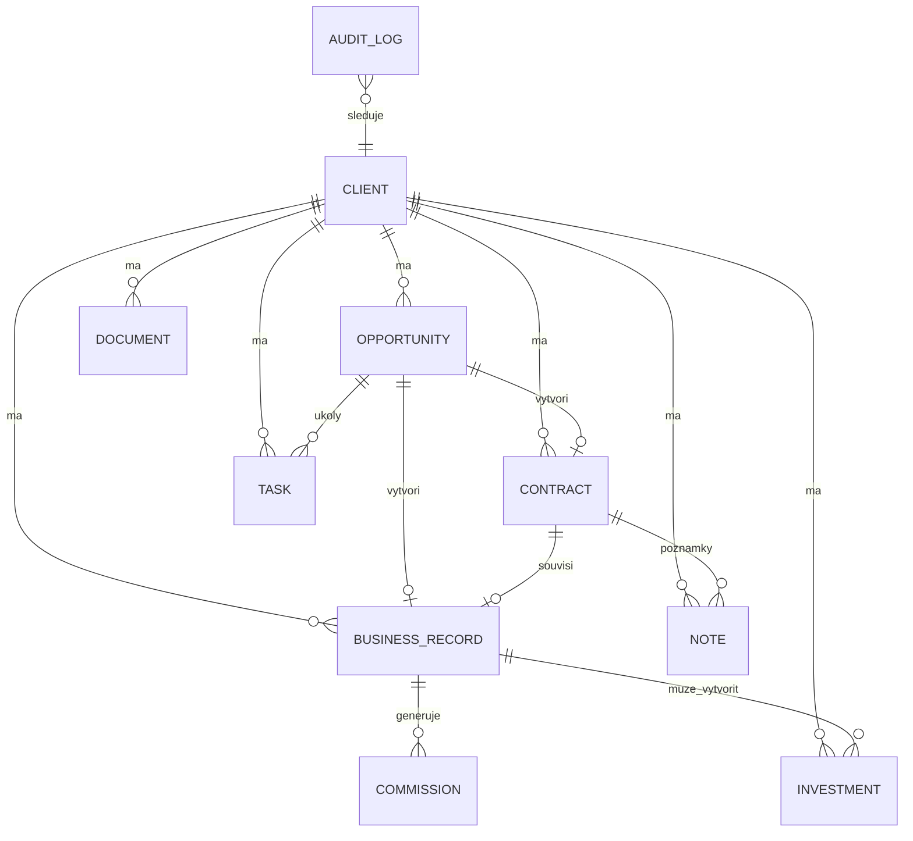

# ARCHITECTURE AUDIT - FILIP CRM

Datum auditu: 2026-07-25

## 1. Strucne shrnuti

FILIP CRM je aktualne lokalni HTML aplikace v jednom hlavnim souboru `FILIP-CRM.html`. Pouziva vanilla JavaScript, lokalni uloziste prohlizece a Google Apps Script / Google tabulku jako zalohu. V jednom souboru je soucasne ulozeno UI, datovy model, vypocty, migrace, importy, synchronizace, dashboard, klienti, smlouvy, obchody, prilezitosti, investice, poznamky a rocni plan.

To je prakticke pro rychly prototyp, ale pro dlouhodobe CRM je to rizikove. Nejdulezitejsi smer je ponechat design a ovladani, ale oddelit data, vypocty a obrazovky do jasnych modulu.

## 2. Pouzity technologicky stack

- Lokalni staticky HTML soubor.
- Vanilla JavaScript bez buildu.
- CSS primo v HTML souboru.
- `localStorage` jako hlavni lokalni uloziste.
- Google Apps Script jako synchronizacni mezivrstva.
- Google tabulka jako zaloha.
- Chart.js pro grafy dashboardu.
- FKI modul je zatim vlozen pres samostatny soubor `investment-crm.html`.

## 3. Soucasne hlavni moduly

- Dashboard
- Klienti
- Prilezitosti
- Smlouvy
- Obchody
- Investice
- FKI
- Poznamky
- Rocni plan
- Google zaloha
- Import/migrace starych lokalnich dat

Vsechny moduly jsou dnes technicky spojene v jednom souboru.

## 4. Soucasne ulozene datove oblasti

Hlavni stav aplikace je objekt `state`. Obsahuje zejmena:

- `clients`
- `contracts`
- `deals`
- `opportunities`
- `notes`
- `activities`
- `referrals`
- `investmentRecords`
- `plans`
- `settings`
- `fundValues`
- `lockedFunds`
- `trailSettings`

## 5. Hlavni problemy

1. Jeden soubor ma prilis mnoho odpovednosti.
2. `localStorage` neni vhodny jako dlouhodoba databaze pro tisice klientu a desetitisice zaznamu.
3. Nektere hodnoty se pocitaji na vice mistech a casem mohou zacit davat rozdilne vysledky.
4. Obchody, smlouvy, investice a FKI jsou castecne propojene, ale nemaji jeste plne normalizovany datovy model.
5. Provize jsou soucasti obchodu, ale neexistuje samostatna entita provize.
6. Poznamky uz maji vlastni modul, ale vazby jsou zatim jednoduche.
7. Chybi univerzalni ukoly, dokumenty a auditni log.
8. Mazani je misty tvrde a muze odstranit navazana data.
9. Import a migrace umi slucovat data, ale chybi formalni migracni protokol a kontrolni soucty.
10. Google zaloha je uzitecna, ale zatim neni plnohodnotny databazovy backend.

## 6. Duplicity a spatne vazby

Rizikova mista:

- Jeden obchod muze vytvorit smlouvu, ale vztah obchod-smlouva neni vsude dusledne pouzity jako centralni vazba.
- Investice mohou vznikat z obchodum, smluv i importu; je potreba jasne rozhodnout, co je hlavni investicni zaznam.
- FKI je dnes oddeleno vizualne, ale data z importu a CRM se budou muset casem sjednotit pres entitu `Investment`.
- Provize je dnes pole u obchodu, misto samostatneho zaznamu navazaneho na obchod.
- Soucty dashboardu a rocniho planu zavisi na vypoctech v UI vrstve.

## 7. Rizikove soubory

- `FILIP-CRM.html` - hlavni aplikace, prilis mnoho odpovednosti.
- `investment-crm.html` - funkcne bohata FKI evidence, zatim samostatna logika.
- `google-sync/*` - zalohovani je klicove pro ochranu dat, musi zustat zpetne kompatibilni.
- `smlouvy-tracker.html` - zdroj logiky vyroci, fixaci a upozorneni.
- `Obchody-tabulka 2.html` - zdroj produkcni a provizni metodiky.

## 8. Vykon a skala

Soucasne reseni nacte velkou cast dat do prohlizece a vse filtruje lokalne. Pro aktualni prototyp je to prijatelne, ale pro cilovy stav je potreba:

- strankovani,
- indexy,
- serverove filtrovani,
- serverove razeni,
- databazove transakce,
- audit zmen,
- obnovitelne zalohy.

## 9. Bezpecnost a zaloha

Soucasny model je vhodny pouze jako lokalni osobni nastroj. Pro dlouhodoby provoz je potreba vyresit:

- prihlaseni,
- opravneni,
- sifrovani citlivych udaju,
- oddeleni soukromeho synchronizacniho klice,
- historii zaloh,
- obnovu ze zalohy,
- kontrolu nezdarenych zaloh,
- archivaci misto tvrdeho mazani.

## 10. Navrzeny cilovy stav

Doporuceni: modularni monolit.

Logicke moduly:

- `clients`
- `opportunities`
- `contracts`
- `business`
- `commissions`
- `investments`
- `notes`
- `tasks`
- `documents`
- `dashboard`
- `plans`
- `backup`
- `audit`
- `settings`

Design muze zustat stejny. Zmena ma byt hlavne pod povrchem: jednotny datovy model, centralni sluzby a jeden zdroj pravdy.

## 11. Navrzeny datovy model

Zakladni entity:

- `Client`
- `Opportunity`
- `Contract`
- `BusinessRecord`
- `Commission`
- `Investment`
- `Note`
- `Task`
- `Document`
- `AnnualPlan`
- `AuditLog`

Klicove pravidlo:

- Klient je hlavni nadrazena entita.
- Prilezitost je rozpracovany obchod.
- Podepsana prilezitost vytvari smlouvu, obchod a provizi.
- Obchod je hlavni zdroj produkce.
- Provize je navazana na obchod.
- Investice je navazana na klienta a idealne na obchod.
- Dashboard a rocni plan jen pocitaji pohled nad skutecnymi daty.

## 12. Diagram vazeb

## 13. Doporučeny postup refaktoringu

Faze 0 - ochrana dat:

- Pred kazdou vetsi upravou ulozit kopii `FILIP-CRM.html`.
- Stahnout lokalni export/zalozni HTML nebo JSON stav, pokud bude k dispozici.
- U Google zalohy nejdriv nacist nahled, porovnat pocty a az potom odesilat.

Faze 1 - vnitrni poradek bez zmeny vzhledu:

- Vytvorit centralni selektory pro klienty, smlouvy, obchody, investice a provize.
- Sjednotit vypocty dashboardu, rocniho planu a klientskych karet.
- Nechat UI stejne.

Faze 2 - propojeni obchodniho procesu:

- Prilezitost ve stavu `Podepsano` prevadet kontrolovane na smlouvu, obchod a ocekavanou provizi.
- Udelat jeden helper, ktery vytvori vsechny vazby najednou.
- Pri chybe neulozit castecny vysledek.

Faze 3 - provize:

- Oddelit provize z obchodu do samostatne entity `Commission`.
- Zachovat zpetnou kompatibilitu se starymi poli `actualCommission` a `commissionPaid`.

Faze 4 - investice:

- Vytvorit jednotnou entitu `Investment`.
- Rozdelit `investmentType` na `classic` a `fki`.
- FKI modul napojit postupne, ne naraz prepsat.

Faze 5 - poznamky, ukoly, dokumenty:

- Poznamky rozsirit o vazby na klienta, prilezitost, smlouvu, obchod a investici.
- Pridat ukoly jako samostatnou entitu.
- Dokumenty zatim evidovat metadaty, soubory resit az po volbe uloziste.

Faze 6 - databaze:

- Pro delsi provoz prejit z `localStorage` na normalni databazi.
- Preferovany cil: PostgreSQL.
- Mezistupen muze byt IndexedDB, pokud aplikace zustane lokalni.

## 14. Migracni plan

Pred migraci porovnat:

- pocet klientu,
- pocet smluv,
- pocet prilezitosti,
- pocet obchodu,
- pocet investic,
- pocet poznamek,
- soucet BJ,
- soucet obratu,
- soucet investic,
- soucet hypoték,
- ocekavanou provizi,
- vyplacenou provizi.

Kazda migrace musi mit:

- kopii puvodniho souboru,
- kopii lokalniho stavu,
- log preskocenych duplicit,
- log opravenych vazeb,
- moznost vratit se k predchozi verzi.

## 15. Testy k doplneni

Minimalni scenare:

- zalozeni klienta,
- zalozeni prilezitosti,
- prevod podepsane prilezitosti na obchod a smlouvu,
- zobrazeni stejne smlouvy v klientovi i v hlavni zalozce,
- zmena smlouvy se projevi vsude,
- obchod se zapocte do dashboardu a rocniho planu,
- zaplacena provize zmizi z ocekavanych provizi,
- FKI se nemicha do beznych investic,
- bezne investice se nemichaji do FKI,
- import ze zalohy neprepisuje nova lokalni data bez potvrzeni,
- duplicita smlouvy upozorni podle cisla smlouvy,
- poznamka se vyhleda podle nazvu, klienta a stitku.

## 16. Dalsi doporuceny krok

Neprepisovat aplikaci celou. Dalsi bezpecny krok je vybrat jeden proces a opravit ho end-to-end:

1. `Prilezitost -> Podepsano -> Obchod + Smlouva + Provize`
2. az potom sjednotit investice a FKI pres jednu entitu `Investment`
3. potom oddelit provize
4. potom resit uloziste mimo `localStorage`

Tento audit je prvni faze. Na jeho zaklade se ma pred vetsim refaktoringem potvrdit dalsi konkretni krok.
